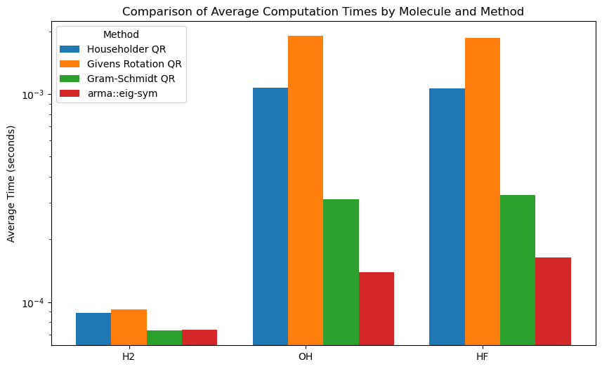

# Exploring the QR Algorithm: Comparison of QR decomposition methods
#### CHEM279 Final
#### Amar Jilani

## Introduction 
This repository contains implementations of the QR algorithm, offering three different QR decomposition methods: Householder QR decomposition, Givens QR decomposition, and Gram-Schmidt QR decomposition. Each method provides a unique approach to solving eigenvalue problems efficiently. Eigenvalue-solving algorithms are crucial in quantum chemistry, where they play a pivotal role in solving the Schrödinger equation. This equation is fundamental for predicting the behavior and properties of quantum systems. The QR algorithm enables the determination of molecular orbital energies, facilitates the calculation of vibrational and rotational energy levels, and aids in modeling electronic transitions. Accurate and efficient eigensolving methods, such as those implemented here, underpin the computational exploration of molecular structures and quantum phenomena, providing researchers with essential tools for understanding the quantum world.

## About this project
The purpose of this project was to explore and become familiar with a well-known eigenvalue algorithm. This involves implementing it, as well as analyzing the performance against other methods, such as Armadillo's divide-and-conquer method. 

### QR Algorithm Implementations
This repository provides three distinct implementations of the QR decomposition:

1. **Householder QR Decomposition:** 
   - Uses Householder reflections to reduce a matrix to upper triangular form.
   - Ideal for numerical stability and computational efficiency.

2. **Givens QR Decomposition:**
   - Employs Givens rotations to zero out subdiagonal elements.
   - Particularly useful for handling sparse matrices and computationally efficient.

3. **Gram-Schmidt QR Decomposition:**
   - Utilizes the classical Gram-Schmidt process for orthogonalization.
   - Can be less stable numerically, but provides a clear understanding of the decomposition process.

### File Structure
The root directory contains the implementation of the QR algorithm for solving eigen problems. This is contained in `qr.cpp` and the header file `qr.h`.
There are also various tests:
- test_methods.cpp: This test compares the correctness of the different QR decomposition methods compared to the built-in Armadillo divide-and-conquer method. This program prints out the eigenvectors and eigenvalues out to the console. 
- timed_test.cpp: This test compares the runtime of each method to compare the computational efficiency of the different decomposition methods. 
- sparse_test.cpp: This test compares the Given rotation QR decomp and Householder method on sparse matrices. 
- Makefile - this contains targets for building the tests above. 

#### Sub-directories 

- /PS5 : This directory contains PS5 (SCF CNDO/2) code to test the integration of the QR algorithm into pre-existing software. 
- /images : contains plots for this README 

### Usage

The QR algorithm is implemented in `qr.cpp` and the function signature is contained in the `qr.h` header file.
The function `qrAlgorithm` was modelled to mimic the function call of the built-in Armadillo `eig-sym` function. 
It can be used in any program for solving eigenvalue problems by including `qr.h` and linking `qr.cpp`. 
~~~cpp
void qrAlgorithm(arma::mat& A, 
                arma::vec &eigval, 
                arma::mat &eigvec, 
                int maxIterations = 10000, 
                double tol = 1e-6, 
                bool verbose=false, 
                std::string method="h")
~~~
As shown above, the function takes in the matrix A and returns the solved eigenvectors and eigenvalues in the `eigval` and `eigvec` variables. 
The `maxIterations` argument sets how many iterations the QR algorithm should run, while `tol` sets the tolerance for convergance. 
The `verbose` arguments outputs additional information about the number of iterations it takes before convergance. 
The `method` argument allows you to specify the type of QR decomposition algorithm:
- `h` : This utilizes the Householder transformation
- `g` : This utilizes the Givens rotation 
- `gs`: This utilizes the classical Gram-Schmidt algorithm 
>Note: Make sure to include the `qr.h` header when including this function! And link `qr.cpp` when compiling! Take a look at the test programs and the Makefile as an example. 

To make the tests:
~~~bash
> make test_methods
g++ -o test_methods test_methods.cpp qr.cpp -std=c++11 -O3 -larmadillo
> ./test_methods
Original Matrix A:
   0.2626   0.7735   1.1828 ... 
   ... 
Eigenvalues (Gram-Schmidt):
  -2.1674
  -1.1187
  -0.7235
  ...

> make timed_test
g++ -o timed_test timed_test.cpp qr.cpp utils/timer.cpp -std=c++11 -O3 -larmadillo
> ./timed_test
Average time for arma::eig_sym: 0.000756778
Average time for householder QR: 0.108851
Average time for Given rotation QR: 0.329679
Average time for Gram-Schmidt QR: 0.0170189

> make sparse_test
g++ -std=c++11 -O3 -o sparse_test sparse_test.cpp qr.cpp -larmadillo
> ./sparse_test
Matrix Size: 10, Sparsity: 0.1
Householder Time: 0.00571446 seconds
Givens Time: 3.3625e-05 seconds

~~~

To test the performance of these implementations in a quantum chemistry application, you can navigate to the `PS5` directory. From there, you can run make to generate the `hw5` executable. You can then run this program and specify which eigensolver you would like to use.
- `e` - uses the standard armadillo eig_sym 
- `h` - uses the Householder method
- `g` - uses the Givens rotation 
- `gs` - uses Gram-Schmidt 

~~~bash
> make
g++ -std=c++20 -o hw5 main.cpp CNDO.cpp AO.cpp util.cpp ../qr.cpp ../utils/timer.cpp -larmadillo -O3
> ./hw5 ./sample_input/HO.txt h
...
...
Electron gradient: 
  -45.8260   45.8260
         0         0
         0         0
Gradient: 
   2.9268  -2.9268
        0        0
        0        0
Time for SCF using Householder method: 0.00373954 seconds
~~~

>Note: you may have to run a few times to get a better sense of the timings! The first run is usually a bit slower. 

#### Here are some example results of comparing the SCF time for diatomic molecules! 

